<div align="center">

# 🌟 Ahmed Hassan
### Android Developer & Mobile Innovation Expert from Egypt 🇪🇬

<div align="center">

</div>


<br/>

[](https://github.com/ahmed-hassan-coder-x)
[](https://developer.android.com/)
[](https://kotlinlang.org/)
[](https://developer.android.com/jetpack/compose)
[](https://github.com/ahmed-hassan-coder-x)

</div>

---

## 🎯 Who Am I?

<table>
<tr>
<td width="50%">

**🚀 Android Developer & AI Enthusiast**
- Building next-gen mobile apps with AI integration
- Specializing in Jetpack Compose & Clean Architecture
- Coding directly on mobile devices 📱
- Contributing to AndroidIDE & Sketchware Pro

**💡 Currently Learning:**
- Advanced Kotlin Coroutines
- Machine Learning for Mobile
- Performance Optimization

</td>
<td width="50%">

```kotlin
class AhmedHassan : AndroidDeveloper {
    val location = "Egypt 🇪🇬"
    val passion = "Mobile Innovation"
    val expertise = "AI Integration"
    
    fun skills() = listOf(
        "Jetpack Compose",
        "Kotlin & Java",
        "AI Integration",
        "Clean Architecture",
        "Mobile-First Development"
    )
    
    fun motto() = "Code. Create. Innovate."
}
```

</td>
</tr>
</table>

---

## 🛠️ Tech Arsenal

<div align="center">

### 📱 Mobile Development


### 🌐 Web & Frontend


### 🖥️ Operating Systems


### 🔧 Tools & Platforms


</div>

---

## 💻 Development Tools

<div align="center">

<table>
<tr>
<td align="center" width="120">
<a href="https://github.com/Sketchware-Pro/Sketchware-Pro">

<br/><b>Sketchware Pro</b>
</a>
</td>
<td align="center" width="120">
<a href="https://github.com/AndroidIDEOfficial/AndroidIDE">

<br/><b>AndroidIDE</b>
</a>
</td>
<td align="center" width="120">
<a href="https://developer.android.com/studio">

<br/><b>Android Studio</b>
</a>
</td>
<td align="center" width="120">
<a href="https://code.visualstudio.com/">

<br/><b>VS Code</b>
</a>
</td>
<td align="center" width="120">
<a href="https://visualstudio.microsoft.com/">

<br/><b>Visual Studio</b>
</a>
</td>
</tr>
</table>

### 💡 **Revolutionary Approach: Building Professional Apps on Mobile** 📱

</div>

---

## 📊 GitHub Analytics & Performance

<div align="center">

### 🏆 **Core Statistics**


### 📈 **Detailed Overview**


### 💻 **Languages**


<!--  -->

### 📊 **Additional Statistics**

<!--  -->


### ⚡ **Annual Activity Timeline**


### 🏅 **Achievement Showcase**


### 📈 **Profile Metrics Dashboard**
<table>
<tr>
<td align="center">

</td>
<td align="center">

</td>
</tr>
<tr>
<td align="center">

</td>
<td align="center">

</td>
</tr>
</table>

</div>

---

## 🎯 2025 Goals

```mermaid
mindmap
  root((Ahmed Hassan 2025))
    🚀 Build
      AI-Powered Apps
      Clean Architecture
      Performance Focus
    📚 Learn
      Advanced Kotlin
      Machine Learning
      System Design
    🤝 Contribute
      Open Source
      Developer Community
      Knowledge Sharing
    🌟 Achieve
      10K+ GitHub Stars
      Global Recognition
      Tech Leadership
```

<div align="center">



</div>

---

## 🌐 Connect With Me

<div align="center">

[](mailto:ahmed.hassan.dev.official@gmail.com)
[](https://github.com/ahmed-hassan-coder-x)
[](https://t.me/AhmedCoderX)
[](https://discord.gg/ahmed-hassan-dev)

### 🤝 **Let's Collaborate On:**
🚀 **Innovative Android Projects** • 🤖 **AI-Powered Solutions** • 📱 **Mobile Innovation** • 🌟 **Open Source**

</div>

---

<div align="center">

## 📈 Profile Stats


---

## 💫 Vision


### 🌟 **"Transforming Ideas into Digital Reality from the Heart of Egypt"**

---

## 🎁 Support My Journey

⭐ **Star my repositories**  
🤝 **Contribute to my projects**  
📢 **Share my work**  
🌟 **Follow for more innovations**


---

*🚀 Building the future, one commit at a time | Made with ❤️ by Ahmed Hassan*

</div>
