# 🚀 Welcome to My Universe

## I'm Ahmed Hassan — Android Developer from <a href="https://en.wikipedia.org/wiki/Egypt" target="_blank">Egypt 🇪🇬</a>

 

---

## 🎯 About Me

### 🔥 Passionate Android Developer & Mobile Innovation Engineer

- **🚀 Expertise**: Android Development, Jetpack Compose, Material Design 3
- **💡 Focus**: AI-integrated Android projects & Modern Architecture patterns  
- **📚 Currently Learning**: Kotlin Coroutines, Clean Architecture, Advanced Jetpack Libraries
- **🎨 Specialization**: UI/UX Design, Performance Optimization, Custom Components
- **📱 Unique Approach**: Building professional apps directly on mobile devices
- **💬 Ask me about**: Android, Kotlin, Jetpack Compose, Mobile Architecture
- **📧 Contact**: `ahmed.hassan.dev.official@gmail.com`

---

## 🛠️ Tech Stack & Expertise

### 📱 **Mobile Development**

### 🌐 **Web Technologies**

### 🔧 **Tools & Platforms**

### 🐧 **Systems**

---

## 💻 Development Environment

### 🔥 **Mobile-First Development Setup**

<table>
<tr>
<td align="center" width="140">
<a href="https://github.com/Sketchware-Pro/Sketchware-Pro">

 <strong>Sketchware Pro</strong>
 Visual Development
</a>
</td>
<td align="center" width="140">
<a href="https://github.com/AndroidIDEOfficial/AndroidIDE">

 <strong>AndroidIDE</strong>
 Mobile IDE
</a>
</td>
<td align="center" width="140">
<a href="https://developer.android.com/studio">

 <strong>Android Studio</strong>
 Official IDE
</a>
</td>
<td align="center" width="140">
<a href="https://code.visualstudio.com/">

 <strong>VS Code</strong>
 Code Editor
</a>
</td>
<td align="center" width="140">
<a href="https://github.com/">

 <strong>GitHub</strong>
 Version Control
</a>
</td>
</tr>
</table>

### 💡 **Revolutionary Approach**
> **Building Enterprise-Grade Android Applications Directly on Mobile Devices** 📱
> 
> *Pioneering the future of mobile-first development using cutting-edge tools*

---

## 📊 GitHub Analytics & Performance

### 🏆 **Core Statistics**

### 📈 **Contribution Overview**

### 💻 **Languages & Achievements**

<!-- خيار 1: الحل الأساسي المحسن -->

<!-- خيار 2: حل بديل بخدمة مختلفة -->
<!--  -->

<!-- خيار 3: حل يدوي بديل -->
<!-- 

<table>
<tr><td></td></tr>
<tr><td></td></tr>
<tr><td></td></tr>
<tr><td></td></tr>
<tr><td></td></tr>
</table>

-->

### ⚡ **Activity Timeline**

---

## 🎯 Current Projects & Goals

```mermaid
mindmap
  root((Ahmed Hassan))
    🚀 Current Focus
      AI Integration
      Jetpack Compose UI
      Performance Optimization
    📚 Learning Path
      Kotlin Coroutines
      Clean Architecture
      Advanced Testing
    🤝 Contributions
      Open Source Projects
      AndroidIDE Development
      Community Support
    🌟 Goals 2024
      Mobile Innovation
      Architecture Patterns
      Developer Community
```

---

## 🌐 Connect & Collaborate

### 💬 **Let's Build Something Amazing Together!**

### 🤝 **Open for Collaboration On:**
- 🚀 **Innovative Android Projects**
- 🤖 **AI-Powered Mobile Solutions**
- 🏗️ **Clean Architecture Implementation**
- 📱 **Mobile-First Development**
- 🌟 **Open Source Contributions**
- 🎓 **Knowledge Sharing & Mentoring**

---

## 📊 Profile Analytics

---

## 💫 Philosophy & Vision

### 🌟 **"Transforming Ideas into Digital Reality"**

> *Every line of code is a step towards innovation. Every project is an opportunity to learn. Every collaboration is a chance to grow.*

---

## 🎁 Support My Work

If you find my projects helpful or inspiring, consider:

⭐ **Starring my repositories**  
🤝 **Contributing to my open source projects**  
📢 **Sharing my work with the community**  
☕ **Buying me a coffee** *(coming soon)*

### 🚀 **Together, let's build the next generation of mobile experiences!**

---

*Made with ❤️ by Ahmed Hassan | Last updated: $(date +'%B %Y')*

